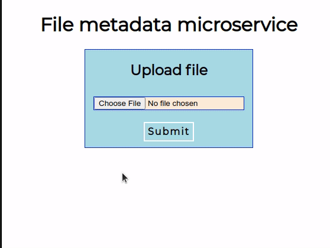

# file-metadata-microservice
Node.js microservice which returns file metadata

[Live site on glitch](https://power-rift-monday.glitch.me)  

  

## Instructions
-go to https://power-rift-monday.glitch.me  
-upload a file to receive its metadata in JSON

## Built With

* [Node JS](https://nodejs.org/en/)

## Acknowledgments

* This project idea is from freeCodeCamp    
